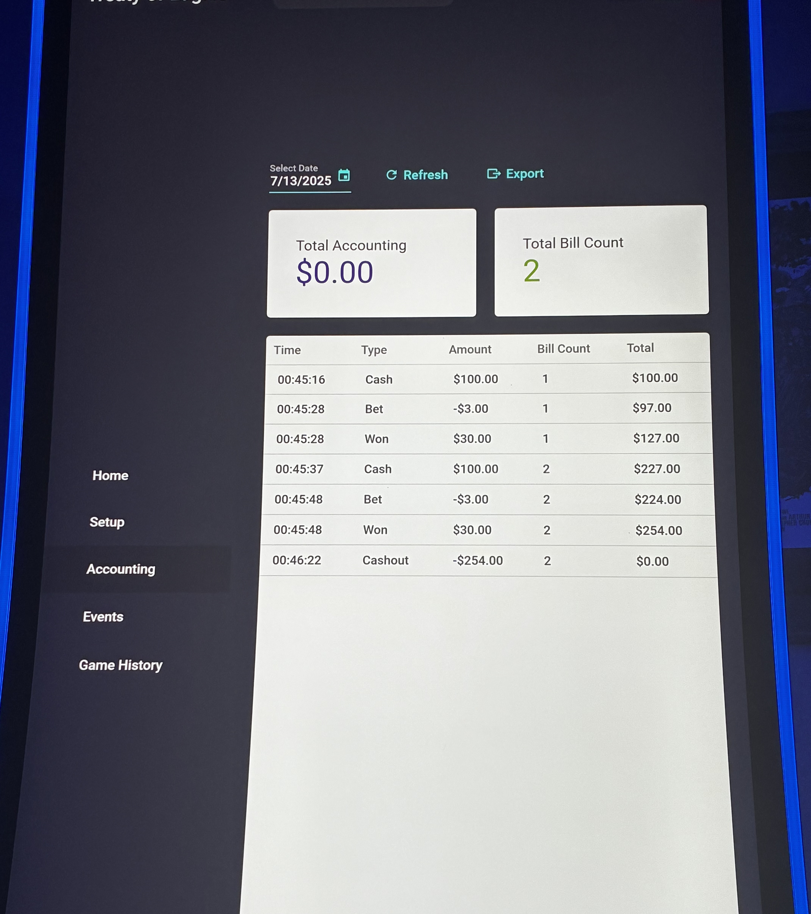
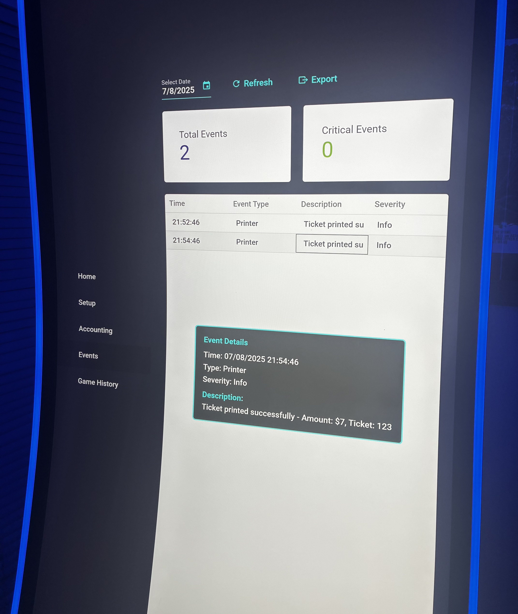
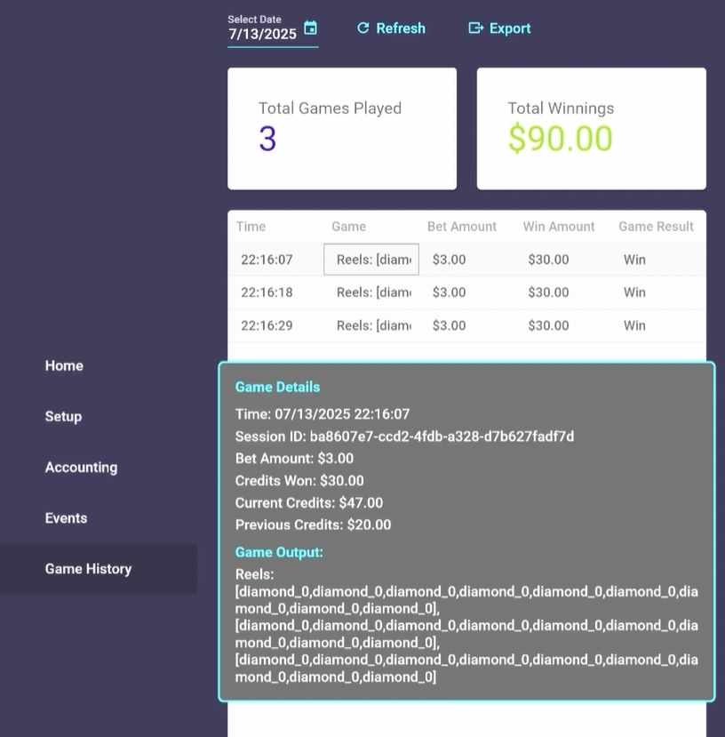
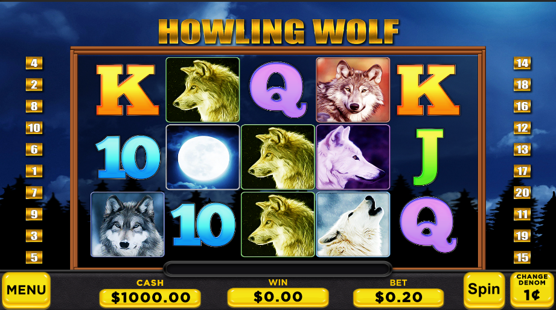

## Update

I developed a fully functional slot machine prototype using Unity and C#, designed to mirror real casino gameplay and hardware behavior.

## Accounting

 

## Events

 

## Game History

 

## Unity Game

 

The project implements core slot mechanics including reel spinning logic, payline evaluation, wild symbols, bonus/free-spin features, and paytable math, with animations driven by DOTween for smooth reel motion, overshoot, and settle effects.

The prototype includes a .NET backend that connects to real casino hardware, bill validators and ticket printers, handling cash-in, gameplay, and cash-out inside a physical cabinet. Unity and the backend communicate in real time to validate credits, trigger payouts, and keep hardware and game state in sync.

This project demonstrates end-to-end slot machine development, combining game design, animation, real-time systems, and hardware integration into a production-style prototype.
